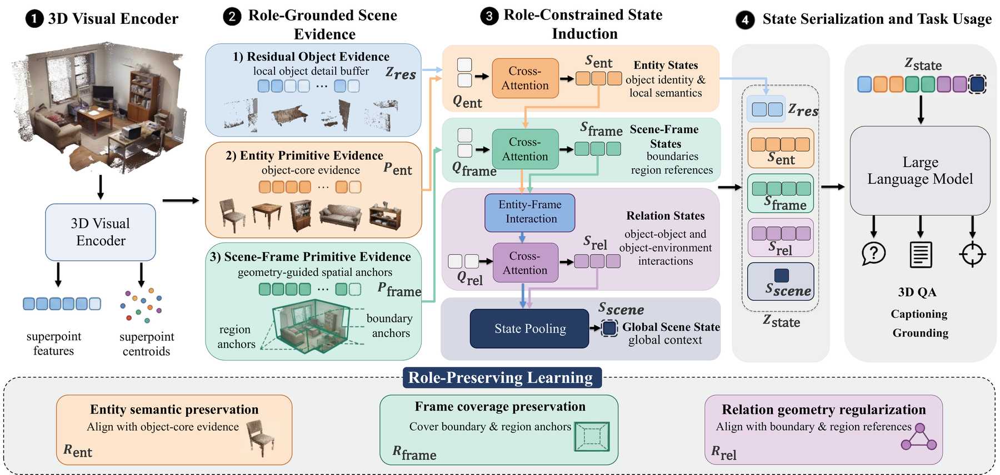
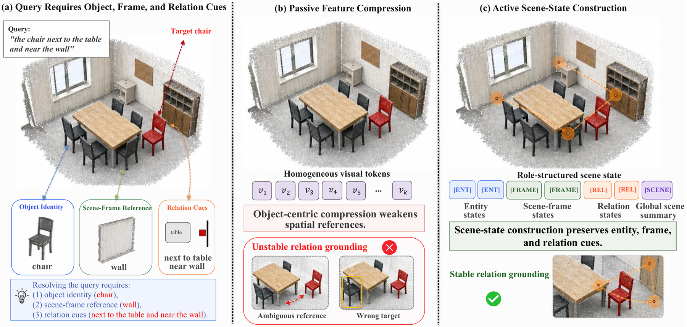

<div align="center">

<h1>SceneScaffold: Active Scene-State Construction<br>for Unified 3D Scene Understanding</h1>

<p>
  <a href="https://neurips.cc/Conferences/2026"></a>
  <a href="https://arxiv.org/abs/XXXX.XXXXX"></a>
  <a href="LICENSE"></a>
  
  
</p>

<p>
  <a href="#">Xiangqi Li</a><sup>1,2</sup>&emsp;
  <a href="#">Libo Huang</a><sup>1&#8224;</sup>&emsp;
  <a href="#">Jiarui Zhao</a><sup>2</sup>&emsp;
  <a href="#">Weilun Feng</a><sup>1,2</sup>&emsp;
  <a href="#">Chuanguang Yang</a><sup>1</sup>&emsp;
  <a href="#">Zhulin An</a><sup>1&#8224;</sup>&emsp;
  <a href="#">Yongjun Xu</a><sup>1</sup>
</p>

<p>
  <sup>1</sup>State Key Laboratory of AI Safety, Institute of Computing Technology, Chinese Academy of Sciences&emsp;
  <sup>2</sup>University of Chinese Academy of Sciences<br>
  <sup>&#8224;</sup>Corresponding authors
</p>

<p>
  <b>Advances in Neural Information Processing Systems (NeurIPS) 2026 &mdash; Spotlight</b>
</p>

</div>

---

<div align="center">
  
  <p><i>SceneScaffold reformulates the visual bottleneck of a 3D large multimodal model from a passive feature compressor into an <b>active scene organizer</b>. Superpoint-level evidence is organized into entity, scene-frame, relation, and global scene states before language reasoning, all under a fixed visual-token budget.</i></p>
</div>

## Overview

Recent 3D large multimodal models (3D-LMMs) rely on a visual bottleneck to compress complex 3D scene evidence into a limited number of visual tokens compatible with large language models. Existing bottlenecks passively compress heterogeneous 3D evidence into a homogeneous, object-centric token sequence, leaving the spatial organization of the scene under-represented and forcing the LLM to recover spatial relations from a flattened sequence.

**SceneScaffold** addresses this issue with an *active scene-state construction* framework. It organizes superpoint-level visual evidence into scene-state components with distinct structural roles:

| State | Role | Default slots |
| :--- | :--- | :---: |
| **Entity states** `S_ent` | Preserve core object semantics | 8 |
| **Scene-frame states** `S_frame` | Maintain spatial references via boundary and region anchors | 8 |
| **Relation states** `S_rel` | Encode object-environment interaction cues | 8 |
| **Global scene state** `S_scene` | Provide compact scene-level context | 1 |
| Residual detail tokens | Retain fine-grained local evidence | 75 |

The total visual-token budget is fixed to **K = 100**, identical to the 3D-LLaVA baseline. Role-preserving objectives (entity semantic preservation, frame coverage preservation, and relation geometry regularization) stabilize the intended function of each state during instruction tuning.

SceneScaffold is evaluated on five 3D vision-language benchmarks covering **3D visual grounding** (ScanRefer, Multi3DRefer), **3D question answering** (ScanQA, SQA3D), and **3D dense captioning** (Scan2Cap).

<details>
<summary><b>Motivation figure</b></summary>
<div align="center">
  
</div>
</details>

## News

- **[2026-09]** SceneScaffold is accepted to **NeurIPS 2026** as a **Spotlight** paper. Code, training scripts, and evaluation scripts are released.
- **[Coming soon]** arXiv preprint.

## Table of Contents

- [Installation](#installation)
- [Data Preparation](#data-preparation)
- [Training](#training)
- [Evaluation](#evaluation)
- [Main Results](#main-results)
- [Repository Structure](#repository-structure)
- [Citation](#citation)
- [Acknowledgements](#acknowledgements)
- [License](#license)

## Installation

The code is built on top of [3D-LLaVA](https://github.com/djiajunustc/3D-LLaVA) and shares its environment. We tested with **Python 3.9**, **PyTorch 2.1.0**, and **CUDA 12.1** on NVIDIA A800 GPUs.

**1. Create the environment**

```bash
git clone https://github.com/lixiangqi707/SceneScaffold.git
cd SceneScaffold

conda create -n scenescaffold python=3.9 -y
conda activate scenescaffold
```

**2. Install PyTorch and Python dependencies**

```bash
pip install torch==2.1.0 torchvision==0.16.0 --index-url https://download.pytorch.org/whl/cu121
pip install -r requirements.txt
```

**3. Install CUDA-specific packages**

```bash
# sparse convolution backend for the Omni Superpoint Transformer (choose the wheel matching your CUDA)
pip install spconv-cu120

# FlashAttention-2 (required by the training entry point llava/train/train_mem.py)
pip install flash-attn --no-build-isolation
```

**4. Build the point-cloud CUDA extensions**

```bash
cd libs/pointops && python setup.py install && cd ../..
cd libs/pointgroup_ops && python setup.py install && cd ../..
```

> **Tip.** The Docker image `djiajun1206/3d-llava-slim` released by 3D-LLaVA already contains a compatible environment and can be used as an alternative to the manual installation.

## Data Preparation

We follow the data protocol of 3D-LLaVA and use ScanNet scans with language annotations from ScanRefer, Multi3DRefer, Nr3D, ScanQA, SQA3D, and Scan2Cap. The processed data can be downloaded from the [3D-LLaVA data release](https://huggingface.co/datasets/djiajunustc/3D-LLaVA-Data) and placed under `./playground`:

```
SceneScaffold
└── playground
    └── data
        ├── scannet
        │   ├── super_points
        │   ├── train
        │   ├── val
        │   └── scannet_axis_align_matrix_trainval.pkl
        ├── train_info
        │   ├── scanrefer_train_3d_llava.json
        │   ├── multi3drefer_train_3d_llava.json
        │   ├── nr3d_train_3d_llava.json
        │   ├── nr3d_caption_train_3d_llava.json
        │   ├── scan2cap_train_3d_llava.json
        │   ├── scanqa_train_3d_llava.json
        │   └── sqa3d_train_3d_llava.json
        └── eval_info
            ├── referseg_scanrefer
            ├── multi3drefer
            ├── scanqa
            ├── sqa3d
            └── densecap_scanrefer
```

The point-cloud encoder is initialized from the stage-1 aligned Omni Superpoint Transformer checkpoint released with 3D-LLaVA. Place it at:

```
SceneScaffold
└── checkpoints
    └── pc_pretrained
        └── ost-sa-only-llava-align-scannet200.pth
```

The language backbone `liuhaotian/llava-v1.5-7b` is downloaded automatically from the Hugging Face Hub on first use.

## Training

SceneScaffold is trained with LoRA in a single instruction-tuning stage on the union of grounding, question answering, and dense captioning data. The point-cloud encoder and the LLM body are frozen; only the scene-state construction modules, cross-modal projection layers, segmentation-query projection layers, and LoRA parameters are optimized.

```bash
bash scripts/train/finetune-3d-llava-ssc3d-su.sh
```

The script is fully configurable through environment variables. The most relevant ones are listed below.

| Variable | Default | Description |
| :--- | :---: | :--- |
| `EXP_NAME` | `finetune-3d-llava-ssc3d-su-lora` | Experiment name; checkpoints are written to `./checkpoints/$EXP_NAME` |
| `MODEL_NAME_OR_PATH` | `liuhaotian/llava-v1.5-7b` | Base LLaVA-1.5 model |
| `STAGE1_CKPT` | `./checkpoints/pc_pretrained/ost-sa-only-llava-align-scannet200.pth` | Pretrained point-cloud encoder |
| `NUM_PC_TOKENS` | `100` | Total visual-token budget `K` |
| `SSC_STATE_ENT_SLOTS` / `SSC_STATE_FRAME_SLOTS` / `SSC_STATE_REL_SLOTS` | `8` / `8` / `8` | Slots per state type |
| `SSC_SCENE_SUMMARY_TOKEN_COUNT` | `1` | Global scene-state tokens |
| `SSC_*_LOSS_WEIGHT` | `0.05` | Role-preserving loss weights |
| `SSC_DETAIL_DROPOUT_RATE` | `0.2` | Dropout rate applied to residual detail tokens |
| `PER_DEVICE_TRAIN_BATCH_SIZE` | `2` | Per-GPU batch size |
| `GRADIENT_ACCUMULATION_STEPS` | `8` | Gradient accumulation steps |
| `NUM_TRAIN_EPOCHS` | `1` | Training epochs |
| `CUDA_VISIBLE_DEVICES` | all | GPUs used by the DeepSpeed launcher |

Other hyper-parameters follow the paper: LoRA rank 32 with alpha 64, AdamW with a learning rate of 2e-4, warm-up ratio 0.03, cosine schedule, bf16 mixed precision, and DeepSpeed ZeRO-1 (`scripts/zero1_3d_llava.json`). Example with an explicit GPU set:

```bash
CUDA_VISIBLE_DEVICES=0,1,2,3,4,5,6,7 bash scripts/train/finetune-3d-llava-ssc3d-su.sh
```

## Evaluation

All evaluation scripts support multi-GPU inference by sharding the evaluation set across `CUDA_VISIBLE_DEVICES`. They default to the checkpoint produced by the training script, `./checkpoints/finetune-3d-llava-ssc3d-su-lora`; override `CKPT_PATH` or `EXP_NAME` to evaluate another model.

```bash
# 3D visual grounding
bash scripts/eval/multigpu_eval_scanrefer.sh      # ScanRefer: referring mIoU + box Acc@0.25/0.5
bash scripts/eval/multigpu_eval_multi3drefer.sh   # Multi3DRefer: referring mIoU + F1@0.25/0.5

# 3D question answering
bash scripts/eval/multigpu_eval_scanqa.sh         # ScanQA (val): CIDEr / BLEU-4 / METEOR / ROUGE-L / EM
bash scripts/eval/multigpu_eval_sqa3d.sh          # SQA3D (test): EM / EM-R

# 3D dense captioning
bash scripts/eval/multigpu_eval_scan2cap.sh       # Scan2Cap (val): C / B-4 / M / R @0.5
```

Predictions and metrics are written to `./playground/predictions/$EXP_NAME/<task>` for question answering and captioning, and to `./outputs/grounding_metrics/<task>` for grounding.

## Main Results

Comparison with point-cloud-only generalist 3D-LMMs under the same visual input. Full comparisons with specialist models and models using additional image inputs are provided in the paper.

| Method | ScanRefer mIoU | Multi3DRefer mIoU | ScanQA C | ScanQA B-4 | ScanQA M | ScanQA R | SQA3D EM | SQA3D EM-R | Scan2Cap C@.5 | Scan2Cap B-4@.5 | Scan2Cap M@.5 | Scan2Cap R@.5 |
| :--- | :---: | :---: | :---: | :---: | :---: | :---: | :---: | :---: | :---: | :---: | :---: | :---: |
| LL3DA | – | – | 76.8 | 13.5 | 15.9 | 37.3 | – | – | 65.2 | 36.8 | 26.0 | 55.1 |
| Grounded 3D-LLM | – | – | 72.7 | 13.4 | – | – | – | – | 70.6 | 35.5 | – | – |
| LSceneLLM | – | – | 88.2 | – | 18.0 | 40.8 | – | – | – | – | – | – |
| 3D-LLaVA | 43.3 | 42.7 | 92.6 | **17.1** | 18.4 | 43.1 | 54.5 | 56.6 | 78.8 | 36.9 | 27.1 | 57.7 |
| NDTokenizer3D | – | 46.0 | **98.6** | 17.0 | **19.4** | 44.9 | 54.4 | 57.1 | 79.0 | 36.7 | 27.1 | 57.7 |
| **SceneScaffold (ours)** | **47.0** | **47.9** | 95.8 | 16.8 | 19.0 | **45.0** | **55.5** | **58.3** | **79.1** | **37.1** | **27.3** | **57.8** |

## Repository Structure

```
SceneScaffold
├── llava/                                # model, data pipeline, training, and evaluation code
│   ├── model/
│   │   ├── llava_arch.py                 # scene-state construction (entity / frame / relation / scene states)
│   │   ├── multimodal_encoder/           # Omni Superpoint Transformer point-cloud encoder
│   │   └── language_model/               # LLaVA-1.5 language model wrapper
│   ├── train/                            # DeepSpeed / LoRA training entry points
│   ├── eval/                             # per-benchmark inference and metric scripts
│   └── pc_utils/                         # point-cloud transforms and utilities
├── libs/                                 # CUDA extensions (pointops, pointgroup_ops)
├── scripts/
│   ├── train/                            # training scripts
│   ├── eval/                             # multi-GPU evaluation scripts
│   └── zero1_3d_llava.json               # DeepSpeed ZeRO-1 configuration
├── docs/                                 # figures used in this README
├── requirements.txt
├── CITATION.cff
└── LICENSE
```

The scene-state construction module is configured through the `--ssc_*` arguments exposed by `llava/train/train.py`; the training script sets them to the values used in the paper.

## Citation

If you find SceneScaffold useful in your research, please consider citing:

```bibtex
@inproceedings{li2026scenescaffold,
  title     = {SceneScaffold: Active Scene-State Construction for Unified 3D Scene Understanding},
  author    = {Li, Xiangqi and Huang, Libo and Zhao, Jiarui and Feng, Weilun and Yang, Chuanguang and An, Zhulin and Xu, Yongjun},
  booktitle = {Advances in Neural Information Processing Systems (NeurIPS)},
  year      = {2026}
}
```

## Acknowledgements

This project is built upon [3D-LLaVA](https://github.com/djiajunustc/3D-LLaVA) and inherits its Omni Superpoint Transformer, data pipeline, and evaluation protocol. We also thank the authors of [LLaVA](https://github.com/haotian-liu/LLaVA), [PonderV2](https://github.com/OpenGVLab/PonderV2), and [OneFormer3D](https://github.com/filaPro/oneformer3d) for their open-source contributions.

This work was supported by Beijing Natural Science Foundation (No. QG26011), National Natural Science Foundation of China (No. 62606510, No. 62476264, and No. 62406312), and the Youth Key Project of the Chinese Academy of Sciences (GFQN-2026-34).

## License

This repository is released under the [Apache License 2.0](LICENSE). The underlying LLaVA-1.5 weights are subject to the [LLaMA 2 license](https://ai.meta.com/llama/license/), and ScanNet data is subject to the [ScanNet terms of use](http://www.scan-net.org/).

## Contact

For questions about the paper or the code, please open an issue or contact Xiangqi Li (`lixiangqi24s@ict.ac.cn`).
